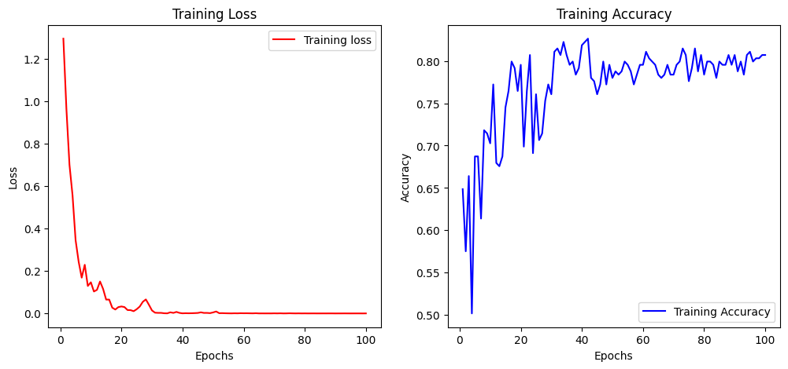

# Knee Arthritis Detection 

## Overview

This project aims to detect knee arthritis using machine learning techniques. Initially, we explored Vision Transformer models using the MedViT pre-trained model, but due to unsatisfactory accuracy, we have shifted to using ResNet-50. Additionally, data augmentation techniques are employed to equalize the size of data in each class and improve detection accuracy.

## Repository Structure

The repository contains the following key files and folders:

- `knee-arthritis-resnet.ipynb`: Jupyter notebook implementing ResNet-50 for knee arthritis detection.
- `data-augmentation.ipynb`: Jupyter notebook for applying data augmentation techniques to the dataset.
- `data`: This folder has the original dataset and augmented dataset. 
- `images`: This folder has some images to display the output of this Algorithm.

## Data

The Original dataset is organized into the following classes based on the severity of knee arthritis:
- `0Normal`: 514 images
- `1Doubtful`: 477 images
- `2Mild`: 232 images
- `3Moderate`: 221 images
- `4Severe`: 206 images

To equalize the size of data in each class, data augmentation techniques such as zooming in, zooming out, rotating/tilting the image, and adding noise are applied. The augmented images are stored in a new folder named `Training_augmented`.

## Data Augmentation Techniques

The following data augmentation techniques are used to enhance the dataset:

1. **Zooming In/Out**: Adjusting the zoom level to focus on different parts of the image.
2. **Rotation/Tilting**: Rotating or tilting the images to introduce variation in the dataset.
3. **Adding Noise**: Adding random noise to the images to make the model robust to variations.

## Usage

1. **Data Augmentation**:
   - Open the `data-augmentation.ipynb` notebook.
   - Run the notebook to apply various augmentation techniques to the dataset.
   - Augmented images will be saved in the `training_augmented/` folder.

2. **Training the Model**:
   - Open the `knee-arthritis-resnet.ipynb` notebook.
   - Follow the steps to load the dataset, preprocess the images, and train the ResNet-50 model.

## Requirements

Ensure you have the following libraries installed to run the notebooks:

- `timm`
- `torch`
- `torchvision`
- `numpy`
- `PIL`
- `matplotlib`

You can install these dependencies using pip:

```bash
pip install -r requirements.txt
```

## Conclusion

This project utilizes ResNet-50 for the detection of knee arthritis and applies data augmentation techniques to improve the model's performance. The shift to ResNet-50 and the addition of augmented data aims to achieve higher accuracy and robustness in detecting different severity levels of knee arthritis. This algorithm gives best accuracy of `82.63%`.

## Results
Here's a Graph to show the performance of this model. Even though the accuracy gets stagnant after 50 epochs, we see the loss reducing every epoch. 



Here's a screenshot to show the performance of this model in *Real time*.


Here's a confusion matrix to show the performance of this model. 


